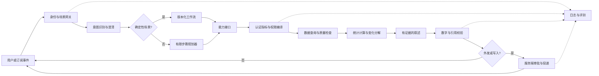

# 数据 Agent 架构审查与优化建议

## 审查范围与结论

本次审查对象是用户提供的《阿里国际-数据Agent架构推演.docx》和岗位截图。工作目录起初没有应用代码、接口、真实数据、部署环境或评测记录，因此**无法证明原方案已经实现，也无法验证其中的性能数字**。文档第 4 部分的履历叙述是草稿，未经本人核实；面试时不得照读成已发生的经历。此仓库新增的最小实现仅用虚构数据验证关键设计边界。

原稿的主线有价值：将业务问答拆成取数、解释、触达和反馈，强调指标口径与评测。最重要的优化，是把原来笼统的“五层加两纵”改为可执行的**控制面与数据面**：配置、口径、授权、审批和评测属于控制面；一次请求如何查询、计算、形成结论属于数据面。每一环都要明确谁负责、输出什么、失败时如何停止。

## 需要修正的具体问题

| 优先级 | 原稿问题 | 风险 | 修订方案 |
|---|---|---|---|
| P0 | “MCP 接入后每次调用都可鉴权、可审计、可限流，治理内建在协议里” | MCP 规定工具与传输接口；授权还依赖实现和部署，业务行列权限、审计和限流需要各服务落实。 | MCP 只用于标准化工具契约；网关与数据服务分别执行身份验证、授权、配额、审计。见 [MCP 规范](https://modelcontextprotocol.io/specification/2025-06-18/basic/authorization) 与 [工具规范](https://modelcontextprotocol.io/specification/2025-06-18/server/tools)。 |
| P0 | “语义层从源头消灭指标幻觉” | 认证指标也可能定义错、数据错或版本过期。 | 表述改为“减少口径漂移”；指标发布要有人负责、双人审查、回归测试及废弃机制。参见 [dbt Semantic Layer](https://www.getdbt.com/blog/how-the-dbt-semantic-layer-works)。 |
| P0 | 将维度贡献写成“主因”，把相关变化写成因果解释 | “贡献了 8 个点”需要明确分母、维度互斥与总量对账；算术分解不能证明业务原因。 | 先列出变化量和贡献，要求各维度求和等于总变化；影响因素只标为“相关线索”或“待验证假设”。 |
| P0 | “欧盟数据不出境”被写成一条普遍规则 | 实际约束由数据类型、主体、流转路径、合同和适用法规决定，不能凭空给出统一结论。 | 建立数据分类、区域与模型部署决策表；由法务和安全团队确认具体跨境限制。本文只提出工程控制点，不作法律结论。 |
| P0 | 对外发送、写操作和首次上线的审批规则混在编排段落 | 容易把模型输出或工具描述当授权。 | 将审批设成服务端执行门：身份、权限、对象、内容、接收者、幂等键都通过后才发送或写入。参见 [OWASP Excessive Agency](https://genai.owasp.org/llmrisk/llm062025-excessive-agency/)。 |
| P1 | “P95 < 3 秒”“成本降一个量级”“95%+ / 90%+”缺场景、样本及出处 | 无法复现，也可能与当前业务口径无关。 | 一律改为待测目标或删除；给出测试集、负载、分位数、成功定义后再报结果。 |
| P1 | “STL 偏离 3σ”像通用异常判定法 | STL 只负责分解；残差分布、季节性、冷启动、稀疏数据都会影响阈值。 | 先做数据完整性检查，再按业务周期选择基线，并用历史回放衡量误报率和漏报率。参见 [STL 方法](https://otexts.com/fpp3/stl.html)。 |
| P1 | 自迭代被描述成“自动回流知识库、按评分被引用” | 负反馈可能由数据、口径、权限或理解错误导致，自动写入会污染知识。 | 反馈先分流、去重、标注、人工裁决；版本化发布并经过回归门禁。 |
| P1 | 四个入口共用内核，但缺“发送许可”和“消息降噪”的实体设计 | 同一用户可能跨渠道收到重复或不适当的结论。 | 增加订阅对象、接收者权限快照、通知预算、去重键、静默时间与撤回/纠错流程。 |
| P1 | 技术演进写成确定的“行业共识”，产品和组织事件混用 | 面试容易被追问来源与适用范围。 | 删除没有可靠一手来源的断言；用“设计选择”与“待验证假设”陈述，不把厂商案例当普适规律。 |
| P1 | 履历映射表含未核实的任职时间、项目和结果 | 可能使候选人在面试中误述经历。 | 改成空白证据模板，先由本人填“背景、职责、动作、结果、可出示证据”。 |

## 优化后的请求链路

核心原则：模型可以提出查询意图和解释草稿；**认证指标、权限、数据质量、数值计算与外发控制必须由确定性服务执行**。MCP 可以承载工具接口，但不是语义层、权限系统或编排器的替身。

## 最小契约与验收标准

| 对象 | 必需字段 | 发布或执行门禁 |
|---|---|---|
| 认证指标 | 名称、版本、公式、时间粒度、单位、维度、负责人、时效、口径生效日 | 样例对账、维度聚合一致性、权限测试、变更审批 |
| 取数请求 | 用户身份、指标版本、日期范围、维度、筛选、预算、追踪 ID | 未认证指标拒绝；权限在数据服务中执行；缺数不当作零 |
| 分析结论 | 数值、时间窗、比较基期、查询 ID、指标版本、假设标签 | 每个数字可追溯；维度变化对齐总变化；因果措辞经人工核查 |
| 通知 | 接收者、目的、内容版本、严重度、去重键、有效期、审批记录 | 发送前复核权限；同事件去重；高风险消息人工放行 |
| 评测样例 | 用户问题、身份、时间、期望指标、期望范围、期望结果或判分准则 | 样例版本固定；口径变化后更新；越权样例必测 |

0 到 1 的第一阶段建议只做一条可控链路：管理者查询一个认证指标，并查看同一口径下的维度变化分解。通过后再增加主动通知和开放式探索。基础验收至少覆盖：口径一致、权限拒绝、数据缺失、时区边界、基期为零、维度求和、证据链、重复通知、故障降级。性能目标应在真实负载下以 P50/P95、超时率、扫描量和单次成本四项共同确定，不预先宣称数值。

## 面试中应明确的三类说法

- **已验证**：仓库示例中的认证指标、市场权限、缺数拒绝、变化分解与证据链通过了自动测试。
- **设计建议**：生产环境需要认证指标服务、真实身份权限、数据质量、审批投递、日志评测和反馈流程。
- **待本人核实**：原文第 4 部分的项目经历、任职年限、效果数字，以及任何可对外披露的业务案例。
